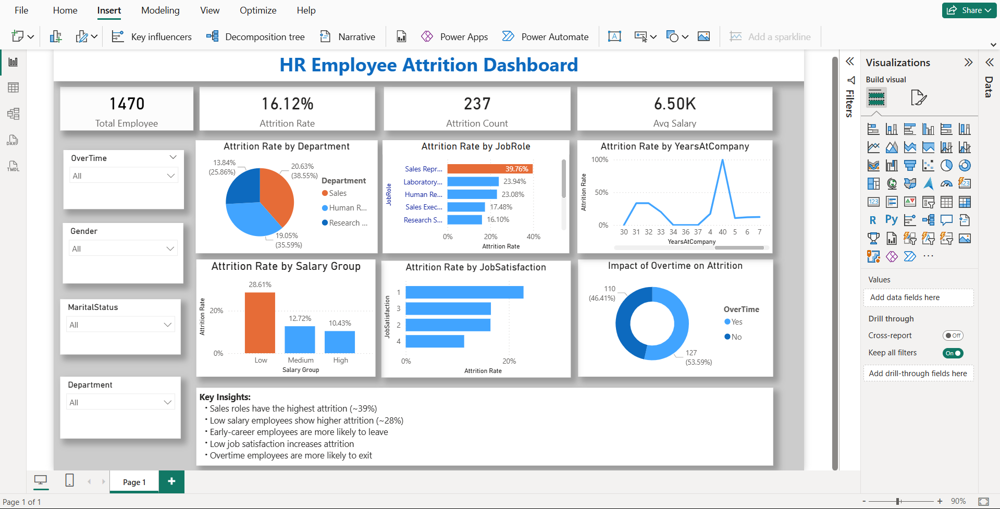

#  HR Employee Attrition Dashboard

##  Overview
This project is an interactive dashboard built using Power BI to understand employee attrition. The goal is to explore why employees leave and identify patterns that can help improve retention.

---

##  Objective
- Understand employee attrition trends  
- Identify key factors behind employee turnover  
- Generate insights that can support better HR decisions  

---

##  Tools Used
- Power BI  
- Power Query (for data cleaning)  
- DAX (for calculations)  

---

##  Data Preparation
Before building the dashboard, the data was cleaned and prepared:
- Removed duplicate employee records  
- Handled missing values  
- Corrected data types  
- Created new columns like Age Group, Salary Group, and Attrition Indicator  

---

##  Key Metrics Created
- Total Employees  
- Attrition Count  
- Attrition Rate  
- Average Salary  

---

##  Dashboard Highlights
The dashboard includes:
- KPI cards showing overall workforce metrics  
- Attrition analysis based on:
  - Job Role  
  - Department  
  - Salary Group  
  - Job Satisfaction  
  - Years at Company  
- Impact of overtime on attrition  
- Interactive filters for better exploration  

---

##  Design Approach
- Used bar and column charts to compare categories  
- Used a line chart to show attrition trends over time  
- Highlighted high attrition areas using color (Red–Orange–Green)  
- Kept the layout clean and easy to understand  

---

##  Key Insights
- Sales roles show the highest attrition (~39%)  
- Employees with lower salaries tend to leave more (~28%)  
- Early-career employees are more likely to exit  
- Low job satisfaction is linked to higher attrition  
- Overtime employees show higher turnover  

---

## Dashboard Preview

---
##  What I Learned
- How to clean and prepare data using Power Query  
- Creating calculated columns and measures using DAX  
- Designing interactive dashboards in Power BI  
- Turning raw data into meaningful business insights 
---
## 🚀 Conclusion
This dashboard provides a clear view of employee attrition and highlights the main factors influencing it. The insights can help organizations take steps to improve employee satisfaction and retention.

 
